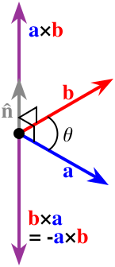
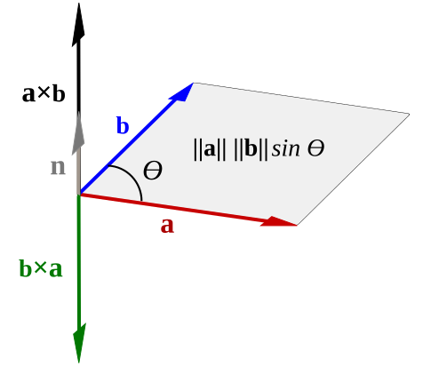
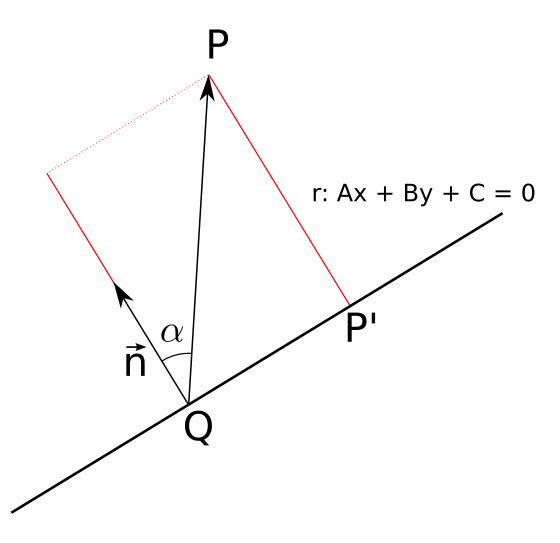
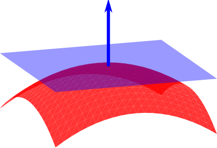

> 介绍点积、叉积、三重积、距离计算和法向量构造，说明它们在计算几何中的常见用途。

## 1. 点积

设两个三维向量为

$$
\mathbf{a}=(a_x,a_y,a_z),\qquad
\mathbf{b}=(b_x,b_y,b_z)
$$

它们的点积定义为

$$
\mathbf{a}\cdot\mathbf{b}
=a_xb_x+a_yb_y+a_zb_z
$$

从几何意义上看，点积也可以写成

$$
\mathbf{a}\cdot\mathbf{b}
=\left\|\mathbf{a}\right\|\left\|\mathbf{b}\right\|\cos\theta
$$

<em>图 1：点积可以理解为一个向量在另一个向量方向上的投影关系。</em>

其中，$\theta$ 是两个向量之间的夹角。因此可以通过点积判断两个向量的夹角关系：

- 当 $\mathbf{a}\cdot\mathbf{b}>0$ 时，夹角为锐角；
- 当 $\mathbf{a}\cdot\mathbf{b}=0$ 时，两个向量正交；
- 当 $\mathbf{a}\cdot\mathbf{b}<0$ 时，夹角为钝角。

如果两个向量均为单位向量，还可以直接通过

$$
\theta=\arccos(\mathbf{a}\cdot\mathbf{b})
$$

计算夹角。

## 2. 叉积

两个三维向量的叉积可以用行列式形式表示：

$$
\mathbf{a}\times\mathbf{b}=
\left|
\begin{array}{ccc}
\mathbf{i} & \mathbf{j} & \mathbf{k}\\\\
a_x & a_y & a_z\\\\
b_x & b_y & b_z
\end{array}
\right|
$$

展开后得到

$$
\mathbf{a}\times\mathbf{b}=
(a_yb_z-a_zb_y)\mathbf{i}
+(a_zb_x-a_xb_z)\mathbf{j}
+(a_xb_y-a_yb_x)\mathbf{k}
$$

叉积的结果仍然是一个三维向量，并且同时垂直于 $\mathbf{a}$ 和 $\mathbf{b}$。其模长为

$$
\left\|\mathbf{a}\times\mathbf{b}\right\|
=\left\|\mathbf{a}\right\|\left\|\mathbf{b}\right\|\sin\theta
$$

<em>图 2：叉积结果垂直于两个输入向量，方向由右手定则确定。</em>

因此，叉积常用于计算面积和构造法向量。

### 2.1 由叉积计算面积

以两个向量为邻边的平行四边形面积为

$$
S_{\text{平行四边形}}
=\left\|\mathbf{a}\times\mathbf{b}\right\|
$$

三角形面积是平行四边形面积的一半：

$$
S_{\triangle}
=\frac{1}{2}\left\|\mathbf{a}\times\mathbf{b}\right\|
$$

<em>图 3：叉积的模长等于由两个向量构成的平行四边形面积。</em>

## 3. 用叉积判断二维方向

在二维几何中，可以把向量的第三个分量设为零，再观察叉积的 $z$ 分量。

给定三个点 $A$、$B$、$C$，定义

$$
\overrightarrow{\mathbf{AB}}=(x_B-x_A,\ y_B-y_A)
$$

$$
\overrightarrow{\mathbf{AC}}=(x_C-x_A,\ y_C-y_A)
$$

则二维叉积的标量形式为

$$
\mathrm{cross}(\overrightarrow{\mathbf{AB}},\overrightarrow{\mathbf{AC}})
=(x_B-x_A)(y_C-y_A)
-(y_B-y_A)(x_C-x_A)
$$

它可以用来判断点 $C$ 位于有向边 $AB$ 的哪一侧，也可以判断从 $\overrightarrow{\mathbf{AB}}$ 转向 $\overrightarrow{\mathbf{AC}}$ 时的方向：

- 结果大于零：从 $AB$ 到 $AC$ 为逆时针方向；
- 结果小于零：从 $AB$ 到 $AC$ 为顺时针方向；
- 结果等于零：三个点共线。

这个判断在点是否位于三角形内、凸包构造、线段相交和三角形顶点绕序判断中都很常用。

## 4. 三重积与体积

三个向量的标量三重积定义为

$$
\mathbf{a}\cdot(\mathbf{b}\times\mathbf{c})
$$

它的绝对值表示由三个向量构成的平行六面体体积：

$$
V_{\text{平行六面体}}
=\left|\mathbf{a}\cdot(\mathbf{b}\times\mathbf{c})\right|
$$

如果三个向量从同一个顶点出发，它们还可以用于计算四面体体积：

$$
V_{\text{四面体}}
=\frac{1}{6}
\left|\mathbf{a}\cdot(\mathbf{b}\times\mathbf{c})\right|
$$

这个结论也可以从四面体体积公式得到。以三角形作为底面时，

$$
V=\frac{1}{3}S_0h
$$

而三角形底面积为

$$
S_0=\frac{1}{2}\left\|\mathbf{b}\times\mathbf{c}\right\|
$$

所以最终得到三重积形式的体积公式。

## 5. 常用距离公式

### 5.1 点到点距离

对于两个三维点

$$
A=(x_1,y_1,z_1),\qquad B=(x_2,y_2,z_2)
$$

两点之间的欧氏距离为

$$
d(A,B)=
\sqrt{(x_2-x_1)^2+(y_2-y_1)^2+(z_2-z_1)^2}
$$

### 5.2 点到直线距离

设直线经过点 $A$ 和 $B$，空间中有一点 $P$。点 $P$ 到直线 $AB$ 的距离为

$$
d(P,AB)
=\frac{\left\|\overrightarrow{\mathbf{AP}}\times\overrightarrow{\mathbf{AB}}\right\|}
{\left\|\overrightarrow{\mathbf{AB}}\right\|}
$$

其中

$$
\overrightarrow{\mathbf{AP}}=P-A,\qquad
\overrightarrow{\mathbf{AB}}=B-A
$$

<em>图 4：点到直线的最短距离是点到直线的垂线段长度。</em>

分子表示由 $\overrightarrow{\mathbf{AP}}$ 和 $\overrightarrow{\mathbf{AB}}$ 构成的平行四边形面积，除以底边长度 $\left\|\overrightarrow{\mathbf{AB}}\right\|$ 后就得到高，也就是点到直线的距离。

## 6. 三角形法向量

设三角形顶点为 $A$、$B$、$C$，从顶点 $A$ 出发构造两条边：

$$
\overrightarrow{\mathbf{AB}}=B-A,\qquad
\overrightarrow{\mathbf{AC}}=C-A
$$

三角形的未归一化法向量为

$$
\mathbf{n}
=\overrightarrow{\mathbf{AB}}\times\overrightarrow{\mathbf{AC}}
$$

单位面法向量为

$$
\mathbf{n}_f
=\frac{\overrightarrow{\mathbf{AB}}\times\overrightarrow{\mathbf{AC}}}
{\left\|\overrightarrow{\mathbf{AB}}\times\overrightarrow{\mathbf{AC}}\right\|}
$$

需要注意，交换叉积中两个向量的顺序会改变法向量方向：

$$
\overrightarrow{\mathbf{AC}}\times\overrightarrow{\mathbf{AB}}
=-\left(\overrightarrow{\mathbf{AB}}\times\overrightarrow{\mathbf{AC}}\right)
$$

<em>图 5：曲面某一点的法向量与该点切平面的法向量一致。</em>

因此，在三维模型中计算法向量时，三角形顶点的绕序必须保持一致，否则相邻三角形可能出现法向量朝向相反的问题。

## 7. 从面法向量计算顶点法向量

一个顶点通常连接多个三角形。假设顶点 $P$ 周围有 $n$ 个三角形，其单位面法向量分别为

$$
\mathbf{n}_1,\mathbf{n}_2,\ldots,\mathbf{n}_n
$$

最简单的顶点法向量计算方式，是把这些面法向量相加后再归一化：

$$
\mathbf{n}_ {p}=\mathrm{normalize}\left(\sum_ {i=1}^{n}\mathbf{n}_ {i}\right)
$$

其中，$\mathrm{normalize}(\mathbf{v})=\mathbf{v}/\left\|\mathbf{v}\right\|$，要求 $\left\|\mathbf{v}\right\|\neq 0$。这种方法默认每个相邻三角形的权重相同。在工程计算中，还可以使用加权平均。

### 7.1 面积加权

设第 $i$ 个相邻三角形的面积为 $S_i$，则面积加权的顶点法向量为

$$
\mathbf{n}_ {p}=\mathrm{normalize}\left(\sum_ {i=1}^{n}S_ {i}\mathbf{n}_ {i}\right)
$$

面积较大的三角形对结果影响更大，适合三角网格质量不均匀的情况。

### 7.2 角度加权

设第 $i$ 个三角形在顶点 $P$ 处的内角为 $\theta_i$，则角度加权的顶点法向量为

$$
\mathbf{n}_ {p}=\mathrm{normalize}\left(\sum_ {i=1}^{n}\theta_ {i}\mathbf{n}_ {i}\right)
$$

其中，顶点角度可以通过点积计算。对于三角形 $PQR$，设 $\overrightarrow{\mathbf{PQ}}$ 和 $\overrightarrow{\mathbf{PR}}$ 分别为从 $P$ 指向 $Q$、$R$ 的向量，则

$$
\theta_P
=\arccos\left(
\frac{\overrightarrow{\mathbf{PQ}}\cdot\overrightarrow{\mathbf{PR}}}
{\left\|\overrightarrow{\mathbf{PQ}}\right\|\left\|\overrightarrow{\mathbf{PR}}\right\|}
\right)
$$

角度加权通常能够更好地反映顶点周围曲面的局部形状，在曲面光滑和网格密度不均匀时比较常用。

## 8. 小结

这组公式构成了计算几何中非常基础、也非常常用的工具链：

1. 点积用于计算夹角、判断正交关系；
2. 叉积用于计算面积、判断二维方向和构造法向量；
3. 三重积用于计算平行六面体和四面体体积；
4. 点积和叉积结合，可以得到点到直线的距离；
5. 相邻面法向量经过平均或加权平均，可以得到顶点法向量。

在实际实现中，还需要额外注意零向量、退化三角形、浮点误差以及三角形顶点绕序等问题。尤其是在归一化之前，应先判断向量长度是否接近零，避免产生无效的法向量。
