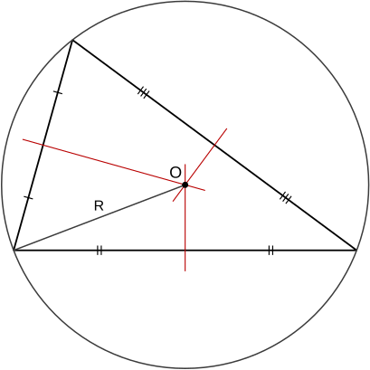
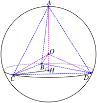
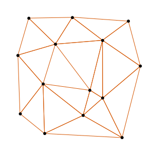

> Day 02 主要学习四类计算几何谓词：orient2D、orient3D、inCircle 和 inSphere。它们通常只关心行列式的符号，用来判断点、线、面、圆和球之间的相对位置。

## 1. 为什么使用几何谓词

计算几何中有很多问题并不需要知道一个量的精确数值，只需要知道它是正数、负数还是零。例如：

- 一个点在有向直线的左侧还是右侧；
- 一个点在有向平面的哪一侧；
- 一个点在三角形外接圆的内部还是外部；
- 一个点在四面体外接球的内部还是外部。

这类用于回答几何关系的符号函数称为**几何谓词**。它们通常由行列式表示：

$$
\mathrm{predicate}
=\det(M)
$$

实际实现时，真正重要的是 $\det(M)$ 的符号，而不是它的绝对大小。当行列式接近零时，浮点舍入误差可能改变符号，因此需要特别处理近共线、近共面和近共圆等退化情况。

## 2. orient2D：二维方向判定

给定二维点 $A$、$B$、$C$，先构造从 $A$ 出发的两个向量：

$$
\overrightarrow{\mathbf{AB}}
=(x_B-x_A,\ y_B-y_A)
$$

$$
\overrightarrow{\mathbf{AC}}
=(x_C-x_A,\ y_C-y_A)
$$

二维方向谓词定义为二维叉积的 $z$ 分量：

$$
\mathrm{orient2D}(A,B,C)
=\overrightarrow{\mathbf{AB}}\times\overrightarrow{\mathbf{AC}}
=(x_B-x_A)(y_C-y_A)
-(y_B-y_A)(x_C-x_A)
$$

在标准右手坐标系中，约定有向边为 $A\rightarrow B$：

- $\mathrm{orient2D}(A,B,C)>0$：点 $C$ 位于有向边 $AB$ 的左侧；
- $\mathrm{orient2D}(A,B,C)<0$：点 $C$ 位于有向边 $AB$ 的右侧；
- $\mathrm{orient2D}(A,B,C)=0$：$A$、$B$、$C$ 三点共线。

### 2.1 与三角形面积的关系

orient2D 还等于三角形 $ABC$ 的**有向面积的两倍**：

$$
2S_{\triangle ABC}^{\mathrm{signed}}
=\mathrm{orient2D}(A,B,C)
$$

因此，交换两个点的顺序会改变符号：

$$
\mathrm{orient2D}(A,C,B)
=-\mathrm{orient2D}(A,B,C)
$$

这也是判断多边形顶点绕序、线段相交和凸包转向的基础。

### 2.2 数值实现注意事项

浮点计算中不建议简单地使用 value == 0 判断共线。更稳妥的方式是设置容差：

$$
\left|\mathrm{orient2D}(A,B,C)\right|<\varepsilon
$$

但 $\varepsilon$ 不应盲目写成一个固定常数，还需要结合坐标量级和输入数据范围。对于对鲁棒性要求较高的凸包、三角剖分和 Delaunay 算法，应使用自适应精度或精确几何谓词。

## 3. orient3D：三维方向判定

给定四个三维点 $A$、$B$、$C$、$D$，由 $A$、$B$、$C$ 构成一个有向平面。定义：

$$
\overrightarrow{\mathbf{AB}}=B-A,\qquad
\overrightarrow{\mathbf{AC}}=C-A,\qquad
\overrightarrow{\mathbf{AD}}=D-A
$$

三维方向谓词为

$$
\mathrm{orient3D}(A,B,C,D)
=\left(\overrightarrow{\mathbf{AB}}\times\overrightarrow{\mathbf{AC}}\right)
\cdot\overrightarrow{\mathbf{AD}}
=\left((B-A)\times(C-A)\right)\cdot(D-A)
$$

它实际上是由三个向量构成的平行六面体的有向体积。

在本篇约定下，$\overrightarrow{\mathbf{AB}}\times\overrightarrow{\mathbf{AC}}$ 是有向平面的法向量：

- $\mathrm{orient3D}(A,B,C,D)>0$：$D$ 位于法向量指向的一侧；
- $\mathrm{orient3D}(A,B,C,D)<0$：$D$ 位于法向量相反的一侧；
- $\mathrm{orient3D}(A,B,C,D)=0$：$A$、$B$、$C$、$D$ 四点共面。

需要注意，不同教材或库可能采用不同的点顺序和正负号约定。因此使用 orient3D 时，必须同时记录输入顺序和符号定义，不能只记“正数代表哪一侧”。

### 3.1 与四面体体积的关系

四面体 $ABCD$ 的有向体积满足

$$
6V_{\mathrm{tetrahedron}}^{\mathrm{signed}}
=\mathrm{orient3D}(A,B,C,D)
$$

四面体的普通体积为

$$
V_{\mathrm{tetrahedron}}
=\frac{1}{6}
\left|\mathrm{orient3D}(A,B,C,D)\right|
$$

当 orient3D 等于零时，四个点共面，四面体退化。

## 4. inCircle：点相对外接圆的判定

给定三个不共线的二维点 $A$、$B$、$C$，它们唯一确定一个外接圆。给定测试点 $D$，可以通过下面的四阶行列式判断 $D$ 与外接圆的关系：

$$
\mathrm{inCircle}(A,B,C,D)=\left|
\begin{array}{cccc}
x_ {A} & y_ {A} & x_ {A}^{2}+y_ {A}^{2} & 1\\\\
x_ {B} & y_ {B} & x_ {B}^{2}+y_ {B}^{2} & 1\\\\
x_ {C} & y_ {C} & x_ {C}^{2}+y_ {C}^{2} & 1\\\\
x_ {D} & y_ {D} & x_ {D}^{2}+y_ {D}^{2} & 1
\end{array}
\right|
$$

当 $A$、$B$、$C$ 按逆时针方向排列，即

$$
\mathrm{orient2D}(A,B,C)>0
$$

有：

- $\mathrm{inCircle}(A,B,C,D)>0$：$D$ 位于外接圆内部；
- $\mathrm{inCircle}(A,B,C,D)=0$：$D$ 位于外接圆上；
- $\mathrm{inCircle}(A,B,C,D)<0$：$D$ 位于外接圆外部。

如果 $A$、$B$、$C$ 按顺时针排列，上述符号会全部反转。因此更稳妥的方向无关判断是：

$$
\mathrm{orient2D}(A,B,C)
\cdot\mathrm{inCircle}(A,B,C,D)>0
$$

此时表示 $D$ 在外接圆内部；等于零表示共圆。

### 4.1 inCircle 的几何意义

inCircle 判断的是**三角形外接圆**，不是判断点是否位于三角形内部。一个点可能在三角形外部，但仍然位于三角形外接圆内部。

<em>图 1：三角形、外接圆和外心的关系。</em>

在 Delaunay 三角剖分中，如果某个点落在三角形外接圆内部，就说明当前三角形违反空圆性质，通常需要进行局部翻边或重新组织三角形。

## 5. inSphere：点相对外接球的判定

给定四个不共面的三维点 $A$、$B$、$C$、$D$，它们唯一确定一个外接球。给定测试点 $E$，可以通过五阶行列式进行判断。

为了让本篇的约定与

$$
\mathrm{orient3D}(A,B,C,D)>0
$$

时“正数表示球内”保持一致，定义 inSphere 时在行列式前加负号：

$$
\mathrm{inSphere}(A,B,C,D,E)
=-
\left|
\begin{array}{ccccc}
x_ {A} & y_ {A} & z_ {A} & x_ {A}^{2}+y_ {A}^{2}+z_ {A}^{2} & 1\\\\
x_ {B} & y_ {B} & z_ {B} & x_ {B}^{2}+y_ {B}^{2}+z_ {B}^{2} & 1\\\\
x_ {C} & y_ {C} & z_ {C} & x_ {C}^{2}+y_ {C}^{2}+z_ {C}^{2} & 1\\\\
x_ {D} & y_ {D} & z_ {D} & x_ {D}^{2}+y_ {D}^{2}+z_ {D}^{2} & 1\\\\
x_ {E} & y_ {E} & z_ {E} & x_ {E}^{2}+y_ {E}^{2}+z_ {E}^{2} & 1
\end{array}
\right|
$$

当 $\mathrm{orient3D}(A,B,C,D)>0$ 时：

- $\mathrm{inSphere}(A,B,C,D,E)>0$：$E$ 位于外接球内部；
- $\mathrm{inSphere}(A,B,C,D,E)=0$：$E$ 位于外接球上；
- $\mathrm{inSphere}(A,B,C,D,E)<0$：$E$ 位于外接球外部。

<em>图 2：四面体与其外接球的空间关系。</em>

当 $A$、$B$、$C$、$D$ 的方向约定反过来时，符号也会反转。因此实际代码中必须固定点的输入顺序，或者使用方向与谓词的乘积进行归一化判断：

$$
\mathrm{orient3D}(A,B,C,D)
\cdot\mathrm{inSphere}(A,B,C,D,E)>0
$$

这表示测试点 $E$ 位于外接球内部。

### 5.1 与 Delaunay 四面体剖分的关系

在三维 Delaunay 四面体剖分中，四面体的外接球内部不应包含其他输入点。inSphere 正是判断候选点是否破坏这一空球性质的核心谓词。

<em>图 3：二维点集的 Delaunay 三角剖分。</em>

## 6. 四类谓词的对比

| 谓词 | 维度 | 输入 | 主要判断 | 零值含义 |
| --- | --- | --- | --- | --- |
| orient2D | 二维 | $A,B,C$ | 点 $C$ 在有向边 $AB$ 的哪一侧 | 三点共线 |
| orient3D | 三维 | $A,B,C,D$ | 点 $D$ 在有向平面的哪一侧 | 四点共面 |
| inCircle | 二维 | $A,B,C,D$ | $D$ 相对三角形外接圆的位置 | 四点共圆 |
| inSphere | 三维 | $A,B,C,D,E$ | $E$ 相对四面体外接球的位置 | 五点共球 |

它们的共同特点是：

1. 都可以表示为行列式；
2. 通常只需要判断结果符号；
3. 输入点的顺序会影响符号；
4. 行列式接近零时容易受到浮点误差影响；
5. 退化输入必须单独处理。

## 7. 工程实现中的常见陷阱

### 7.1 点顺序和符号约定

下面两种写法表示的是同一个几何关系，但符号相反：

$$
\mathrm{orient2D}(A,B,C)
=-\mathrm{orient2D}(A,C,B)
$$

inCircle 和 inSphere 也具有相同的方向敏感性。建议在代码中统一封装谓词接口，并在接口注释中明确符号约定。

### 7.2 退化输入

- orient2D：$A$、$B$、$C$ 共线；
- orient3D：$A$、$B$、$C$、$D$ 共面；
- inCircle：$A$、$B$、$C$ 不应共线；
- inSphere：$A$、$B$、$C$、$D$ 不应共面。

退化时，外接圆或外接球可能不存在，或者不再唯一。

### 7.3 浮点误差

行列式中包含平方项，坐标较大或点接近退化位置时，容易出现严重的消去误差。简单的做法是：

1. 先使用普通浮点数快速计算；
2. 对接近零的结果重新计算；
3. 必要时使用扩展精度、自适应精度或精确整数算法；
4. 统一约定近零结果的处理策略。

### 7.4 不要混淆“谓词”和“度量”

orient2D、orient3D、inCircle 和 inSphere 主要回答“哪一侧、内还是外”这类离散关系，不直接给出真实距离、面积或体积。行列式的绝对值虽然有几何意义，但在数值算法中通常只使用符号。

## 8. 一个简单的使用流程

以判断二维点的位置为例：

1. 明确输入点的顺序；
2. 根据公式计算谓词值；
3. 先判断是否接近零；
4. 非零时根据符号判断几何关系；
5. 在 Delaunay 等算法中，根据判定结果更新拓扑结构。

对于三维点、外接圆和外接球，流程相同，只是行列式阶数和输入点数量不同。

## 9. 小结

Day 02 的核心内容可以概括为：

1. orient2D 用二维叉积判断点相对有向边的位置；
2. orient3D 用混合积判断点相对有向平面的位置；
3. inCircle 用四阶行列式判断点相对三角形外接圆的位置；
4. inSphere 用五阶行列式判断点相对四面体外接球的位置；
5. 所有谓词都依赖输入顺序，符号约定必须保持一致；
6. 接近退化位置时，不能完全依赖普通浮点计算。

这些谓词是凸包、线段相交、三角剖分、Delaunay 网格和网格生成算法中的基础工具。理解它们的几何意义、符号约定和数值稳定性，比单纯记住行列式形式更重要。

## 图片来源与许可

- [Circumcircle.svg](https://commons.wikimedia.org/wiki/File:Circumcircle.svg)：Wikimedia Commons，Public domain。
- [Вписанный тетраэдр.svg](https://commons.wikimedia.org/wiki/File:%D0%92%D0%BF%D0%B8%D1%81%D0%B0%D0%BD%D0%BD%D1%8B%D0%B9_%D1%82%D0%B5%D1%82%D1%80%D0%B0%D1%8D%D0%B4%D1%80.svg)：Wikimedia Commons，CC BY-SA 3.0。
- [Delaunay-Triangulation.svg](https://commons.wikimedia.org/wiki/File:Delaunay-Triangulation.svg)：Wikimedia Commons，Public domain。
