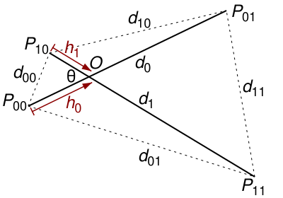
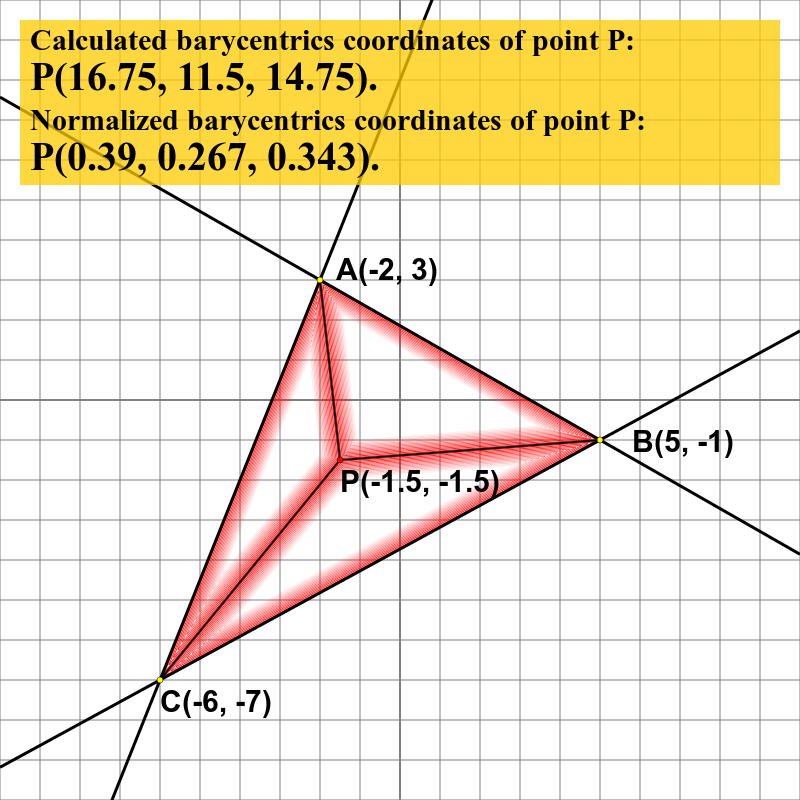
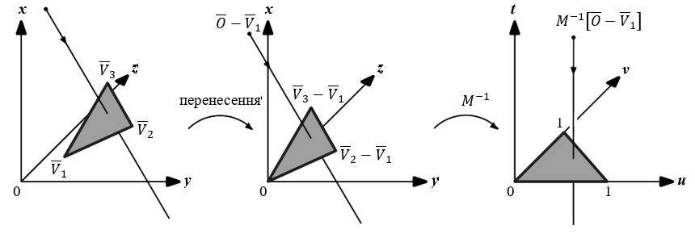

> 介绍二维和三维线段相交、点在三角形内判定、重心坐标和射线与三角形相交检测，涵盖 orient2D、orient3D 与 Möller–Trumbore 算法。

## 1. 二维线段相交判定

已知两条二维线段 $AB$ 和 $CD$。先使用二维方向谓词计算四个有向面积符号：

$$
q_1=\mathrm{orient2D}(A,B,C)
$$

$$
q_2=\mathrm{orient2D}(A,B,D)
$$

$$
q_3=\mathrm{orient2D}(C,D,A)
$$

$$
q_4=\mathrm{orient2D}(C,D,B)
$$

### 1.1 一般相交情况

如果两条线段发生严格交叉，则线段 $AB$ 的两个端点位于直线 $CD$ 的两侧，同时线段 $CD$ 的两个端点位于直线 $AB$ 的两侧：

$$
q_1q_2<0
\quad\text{且}\quad
q_3q_4<0
$$

也可以理解为：$q_1$ 与 $q_2$ 符号相反，$q_3$ 与 $q_4$ 符号相反。

<em>图 1：两条线段相交的几何关系示意图。</em>

### 1.2 共线、端点接触与重叠情况

一般相交条件不能覆盖端点接触和共线重叠。当某个方向谓词等于零时，需要进一步判断该点是否在线段范围内。

设点 $P$ 与线段 $AB$ 共线，则 $P$ 在线段 $AB$ 上的坐标范围条件为

$$
\min(x_A,x_B)\le x_P\le\max(x_A,x_B)
$$

并且

$$
\min(y_A,y_B)\le y_P\le\max(y_A,y_B)
$$

因此，完整的线段相交判断通常包括：

1. 先检查四个方向谓词的符号关系；
2. 如果某个方向谓词为零，再检查对应端点是否落在另一条线段的包围盒内；
3. 只要存在严格交叉、端点接触或共线重叠之一，就认为两条线段相交。

不能只因为某个点落在直线 $AB$ 上，就直接判断它在线段 $AB$ 上；还必须进行上面的坐标范围检查。

## 2. 三维线段相交判定

在三维空间中，如果两条非退化线段相交，那么它们一定共面。给定线段 $AB$ 和 $CD$，可以按下面的流程判断：

1. 先计算

   $$
   \mathrm{orient3D}(A,B,C,D)
   $$

   如果结果不为零，四点不共面，两条线段不能相交。

2. 如果四点共面，将四个点投影到一个合适的二维坐标平面；
3. 对投影后的两条二维线段使用上一节的 `orient2D` 相交判定方法；
4. 对接近共面或接近退化的情况，需要考虑浮点误差和容差策略。

投影平面最好选择能够保留最大投影面积的坐标平面，以减少投影退化带来的数值误差。

## 3. 点在三角形内的判定

给定三角形 $ABC$ 和测试点 $P$。假设三角形顶点按照 $A\rightarrow B\rightarrow C$ 的逆时针方向排列，计算：

$$
s_1=\mathrm{orient2D}(A,B,P)
$$

$$
s_2=\mathrm{orient2D}(B,C,P)
$$

$$
s_3=\mathrm{orient2D}(C,A,P)
$$

如果 $P$ 位于三角形内部，它必须位于三条有向边的同一侧。因此：

- $s_1>0$、$s_2>0$、$s_3>0$：$P$ 严格位于三角形内部；
- $s_1\ge0$、$s_2\ge0$、$s_3\ge0$：$P$ 位于三角形内部或边界上；
- 任意一个值小于零：$P$ 位于三角形外部。

如果 $ABC$ 按顺时针排列，则三个不等式的方向全部反过来。工程实现中可以先统一三角形绕序，也可以同时支持正向和反向两种符号约定。

当某个 $s_i=0$ 时，点 $P$ 位于对应边所在的直线上；若要判断它是否在线段边界上，还需要执行线段范围检查。

## 4. 重心坐标

三角形 $ABC$ 内部的任意一点 $P$，都可以表示为三个顶点的加权和：

$$
P=\alpha A+\beta B+\gamma C
$$

其中三个重心坐标满足：

$$
\alpha+\beta+\gamma=1
$$

几何上，三个系数可以由子三角形面积表示：

$$
\alpha=\frac{S_{PBC}}{S_{ABC}},\qquad
\beta=\frac{S_{PCA}}{S_{ABC}},\qquad
\gamma=\frac{S_{PAB}}{S_{ABC}}
$$

在三角形不退化的情况下：

- $\alpha>0$、$\beta>0$、$\gamma>0$：点在三角形内部；
- 某一个坐标等于零：点在对应边上；
- 某一个坐标小于零：点在三角形外部。

<em>图 2：三角形内一点的重心坐标示意图。</em>

重心坐标除了可以用于点在三角形内的判定，还常用于三角形内插值、纹理映射和有限元形函数计算。

## 5. 三维射线与三角形相交

### 5.1 参数化表示

一条三维射线可以写成

$$
R(t)=O+tD,\qquad t\ge0
$$

其中，$O$ 为射线起点，$D$ 为射线方向，$t$ 为沿射线方向的参数。

对三角形 $ABC$，定义两条边向量：

$$
E_1=B-A,\qquad E_2=C-A
$$

三角形平面内的点可以表示为

$$
P=A+uE_1+vE_2
$$

将射线和三角形的表示式相等，可得：

$$
O+tD=A+uE_1+vE_2
$$

其中，交点位于三角形内部需要满足：

$$
u\ge0,\qquad v\ge0,\qquad u+v\le1
$$

同时，交点位于射线正方向上需要满足 $t\ge0$。

### 5.2 Möller–Trumbore 算法

Möller–Trumbore 算法直接求解参数 $t$、$u$ 和 $v$，不需要显式计算三角形平面方程。定义辅助向量：

$$
P=D\times E_2
$$

$$
\mathrm{det}=E_1\cdot P
$$

当 $\mathrm{det}$ 接近零时，说明射线方向与三角形平面平行，通常认为没有唯一交点。

令

$$
T=O-A
$$

则

$$
u=\frac{T\cdot P}{\mathrm{det}}
$$

如果 $u<0$ 或 $u>1$，交点不在三角形允许的参数范围内。

继续定义

$$
Q=T\times E_1
$$

则

$$
v=\frac{D\cdot Q}{\mathrm{det}}
$$

如果 $v<0$ 或 $u+v>1$，交点位于三角形外部。

最后计算射线参数：

$$
t=\frac{E_2\cdot Q}{\mathrm{det}}
$$

如果 $t<0$，交点位于射线起点的反方向；只有 $t\ge0$ 时才接受该交点。交点坐标为

$$
P_{\mathrm{hit}}=O+tD
$$

<em>图 3：Möller–Trumbore 算法中的射线、三角形和重心参数关系。</em>

## 6. 统一的判断流程

这几类问题可以归纳为一条统一的数据流：

1. 根据输入点构造方向谓词、叉积或混合积；
2. 先判断结果是否接近零，处理共线、共面、端点接触等退化情况；
3. 非退化情况下，根据符号判断点、线段或射线的相对位置；
4. 对三角形内部点，用 $u$、$v$ 或重心坐标检查参数范围；
5. 对射线相交问题，再检查 $t$ 是否位于射线正方向；
6. 最后根据参数计算交点坐标或更新后续几何结构。

## 7. 小结

1. 二维线段相交可以通过四个 `orient2D` 值判断两条线段是否跨过对方所在直线；
2. 共线、端点接触和重叠情况必须额外进行包围盒范围检查；
3. 三维线段相交首先需要判断四点是否共面，再投影到二维处理；
4. 点在三角形内可以用三次方向谓词或重心坐标判断；
5. 射线与三角形相交可以用 $t$、$u$、$v$ 三个参数统一描述；
6. Möller–Trumbore 算法通过叉积和点积直接求解这些参数，适合光线追踪、碰撞检测和三维网格计算。

## 图片来源与许可

- [Parametristion of 2 segments.svg](https://commons.wikimedia.org/wiki/File:Parametristion_of_2_segments.svg)：Colin.champion，CC BY-SA 4.0。
- [Barycentrics coordinates with point inside triangle.png](https://commons.wikimedia.org/wiki/File:Barycentrics_coordinates_with_point_inside_triangle.png)：Stano zo Zvolena，CC0。
- [Moller-Trumbore ray-triangle intersection coordinates transformation.png](https://commons.wikimedia.org/wiki/File:Moller-Trumbore_ray-triangle_intersection_coordinates_transformation.png)：Tomas Möller、Ben Trumbore，CC0。
