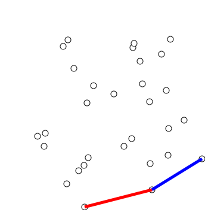
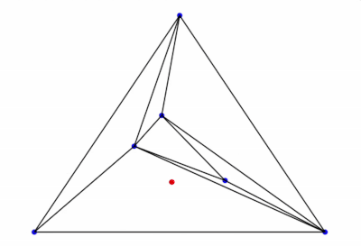

> Day 04 主要学习二维点集的凸包构造和 Delaunay 三角剖分。核心思路是利用 orient2D 维护边界的左转关系，再通过增量插点、空圆判定和局部翻边构造满足 Delaunay 性质的三角网格。

## 1. 凸包的基本概念

给定二维点集 $S$，包含这些点的最小凸多边形称为点集的**凸包**。直观地看，可以把所有点想象成钉在平面上的钉子，再用一根橡皮筋包住它们；橡皮筋经过的外层边界就是凸包。

凸包具有以下性质：

1. 点集中的所有点都位于凸包内部或边界上；
2. 凸包边界上的每条边，其余点都位于这条有向边的同一侧；
3. 凸包顶点沿边界方向排列时，连续三点不会发生右转；
4. 位于凸包内部的点不会成为凸包顶点。

### 1.1 用 orient2D 判断转向

对于三个二维点 $A$、$B$、$C$，定义

$$
\mathrm{orient2D}(A,B,C)=
\det\left[
\begin{array}{cc}
x_B-x_A & y_B-y_A\\
x_C-x_A & y_C-y_A
\end{array}
\right]
$$

展开后为

$$
\mathrm{orient2D}(A,B,C)=
(x_B-x_A)(y_C-y_A)
-(y_B-y_A)(x_C-x_A)
$$

在标准右手坐标系中：

- $\mathrm{orient2D}(A,B,C)>0$：从 $AB$ 到 $BC$ 为左转，也就是逆时针转向；
- $\mathrm{orient2D}(A,B,C)<0$：发生右转，也就是顺时针转向；
- $\mathrm{orient2D}(A,B,C)=0$：三个点共线。

凸包算法的核心，就是不断检查最近的三个候选点。如果出现右转，就说明中间点不可能留在当前凸包边界上，需要把它删除。

### 1.2 上凸包与下凸包

如果先按 $x$ 坐标从小到大排序，再按 $y$ 坐标排序，可以把点集分成两条边界：

- **下凸包**：从最左点向最右点扫描，维护下方的边界；
- **上凸包**：从最右点向最左点扫描，维护上方的边界。

构造任意一条边界时，都可以使用下面的规则：

1. 将新点 $C$ 加入候选栈；
2. 取栈顶的两个旧点 $A$、$B$；
3. 如果 $\mathrm{orient2D}(A,B,C)\le 0$，删除中间点 $B$；
4. 重复检查，直到栈顶三点保持左转；
5. 将 $C$ 保留在栈中。

这里采用 $\le 0$ 的规则会删除共线边上的中间点，只保留端点。如果希望保留凸包边界上的所有共线点，可以把条件改为 $<0$，但后续边界表示和重复点处理也要保持一致。

## 2. Graham Scan

Graham Scan 的基本思想是：先选出一个确定属于凸包的起点，再按照极角顺序扫描其他点，用栈维护当前已经确定的凸包链。



<p style="text-align: center;"><em>图 1：Graham Scan 逐步扫描点集并维护凸包栈的过程。</em></p>

### 2.1 选择起点

在所有点中选择 $y$ 坐标最小的点作为 $P_0$。如果有多个点的 $y$ 坐标相同，则选择 $x$ 坐标最小的点。

这个点一定是凸包顶点之一，因为没有其他点位于它的下方。选定 $P_0$ 后，其他点都可以用相对 $P_0$ 的方向进行排序。

### 2.2 按极角排序

对于其余点 $P_i$，计算向量

$$
\mathbf{v}_i=P_i-P_0
$$

然后按照这些向量相对固定参考方向的极角从小到大排序。实际代码中通常不直接调用反三角函数，而是使用叉积符号比较两个向量的相对方向：

$$
\mathrm{cross}(\mathbf{u},\mathbf{v})
=u_xv_y-u_yv_x
$$

如果两个点与 $P_0$ 的极角相同，还需要处理共线情况。常见做法是按到 $P_0$ 的距离从近到远排序，然后在扫描时删除同一射线上的近点；这样可以保留更远的凸包边界点。

排序完成后得到序列

$$
P_0,P_1,\ldots,P_{n-1}
$$

### 2.3 用栈维护凸包

扫描过程中，栈中保存当前的凸包候选点。基本步骤为：

1. 先将 $P_0$、$P_1$ 放入栈中；
2. 依次读取下一个点 $P_i$；
3. 设栈顶的两个点为 $A$、$B$，当前点为 $C=P_i$；
4. 如果 $\mathrm{orient2D}(A,B,C)\le 0$，弹出栈顶点 $B$；
5. 继续检查新的栈顶三点，直到保持左转；
6. 将 $C$ 压入栈中。

弹出操作的几何意义是：如果 $A$、$B$、$C$ 依次连接后发生右转或三点共线，那么 $B$ 位于当前边界的内侧，不能作为最终凸包顶点。

扫描结束后，将栈中的最后一个点与 $P_0$ 连接，就得到凸包边界。排序需要 $O(n\log n)$ 时间，扫描过程是线性的，因此 Graham Scan 的总体复杂度为

$$
O(n\log n)
$$

## 3. Andrew 单调链算法

Andrew's Monotone Chain 与 Graham Scan 使用相同的方向谓词，但不需要围绕一个起点计算极角。它直接按照坐标排序，然后分别构造下凸包和上凸包。

### 3.1 排序

首先按照 $(x,y)$ 的字典序排序：先比较 $x$，如果 $x$ 相同，再比较 $y$。排序结果记为

$$
P_0,P_1,\ldots,P_{n-1}
$$

这样，点集天然具有从左到右的处理顺序。

### 3.2 构造下凸包

从左到右遍历排序后的点集。对每个新点 $C$，检查当前下凸包的最后两个点 $A$、$B$：

$$
\mathrm{orient2D}(A,B,C)\le0
$$

如果条件成立，就删除 $B$，因为它会导致右转或共线。删除后继续检查新的栈顶，直到满足左转，再把 $C$ 加入下凸包。

下凸包的伪代码逻辑可以概括为：

```text
lower = 空栈
for p in 按 (x, y) 排序的点:
    while lower 至少有两个点且 orient2D(lower[-2], lower[-1], p) <= 0:
        弹出 lower[-1]
    将 p 加入 lower
```

### 3.3 构造上凸包

上凸包使用相同的判断规则，但遍历顺序相反：从最右点向最左点遍历排序后的点集。得到的上凸包和下凸包分别从左右两端连接起来。

合并时要删除重复的左右端点：

1. 保留下凸包的全部点；
2. 保留上凸包的内部点，不重复加入两端点；
3. 按逆时针方向连接，得到完整凸包。

Andrew 单调链的排序复杂度为 $O(n\log n)$，上下凸包的扫描复杂度合计为 $O(n)$，因此总体复杂度同样为

$$
O(n\log n)
$$

与 Graham Scan 相比，Andrew 算法的实现通常更直接，尤其适合使用坐标排序和顺序容器实现。

## 4. Delaunay 三角剖分

### 4.1 三角剖分

给定二维点集 $P$，三角剖分是用点集中的点作为顶点，用线段连接这些点，把点集凸包内部划分成若干个互不重叠的三角形。

一个合法的三角剖分需要满足：

- 每个三角形的顶点来自输入点集；
- 任意两个三角形只共享一个顶点、一条边，或者互不相交；
- 所有三角形的并覆盖点集的凸包区域；
- 不允许出现交叉边。

### 4.2 空圆性质

Delaunay 三角剖分是在普通三角剖分基础上增加了空圆条件：

> 每个 Delaunay 三角形的外接圆内部不包含其他输入点。

如果三角形为 $ABC$，其外接圆内部没有点 $P$，则称该三角形满足空圆性质。四点共圆时属于退化情况，需要根据实现约定决定是否允许等号成立。

空圆性质可以使用前一篇中的 `inCircle` 谓词判断。对于逆时针排列的 $A$、$B$、$C$，如果

$$
\mathrm{inCircle}(A,B,C,P)>0
$$

则测试点 $P$ 位于三角形 $ABC$ 的外接圆内部，当前三角形违反 Delaunay 条件。

### 4.3 Delaunay 三角剖分的几何意义

在所有可能的三角剖分中，Delaunay 三角剖分倾向于避免非常细长的三角形。对于一般位置的点集，它具有最大化三角形最小角的性质，也就是尽量让最小角更大。

这使 Delaunay 三角剖分适合用于：

- 不规则点集的三角网格生成；
- 有限元和有限体积方法的网格划分；
- 地形和散乱数据的曲面重建；
- Voronoi 图的对偶结构构造。

## 5. Bowyer–Watson 增量算法

Bowyer–Watson 是一种通过逐点插入构造 Delaunay 三角剖分的算法。它的关键思想是：每插入一个新点，就删除所有外接圆包含该点的坏三角形，再重新填充由这些三角形留下的空腔。

### 5.1 构造 Super Triangle

首先构造一个足够大的三角形，称为 Super Triangle，使所有输入点都位于它的内部。

Super Triangle 的作用是提供一个初始三角剖分，避免一开始就处理边界为空的问题。最终输出时，必须删除所有包含 Super Triangle 顶点的三角形。

### 5.2 逐点插入

假设当前要插入点 $P_i$，处理流程如下：

1. 遍历当前三角剖分中的三角形；
2. 使用 `inCircle` 判断 $P_i$ 是否位于三角形外接圆内部；
3. 将满足条件的三角形标记为 bad triangle；
4. 删除所有 bad triangle；
5. 找到被删除区域的边界，形成 cavity；
6. 将 $P_i$ 与 cavity 边界上的每条边连接，生成新的三角形；
7. 更新三角形邻接关系。



<p style="text-align: center;"><em>图 2：增量插点、外接圆判定和局部翻边维护 Delaunay 性质的过程。</em></p>

### 5.3 Cavity 边界的提取

删除 bad triangles 后，不能简单地把所有旧边都拿来连接新点。需要判断哪些边属于 cavity 的外边界：

- 如果一条边只属于一个 bad triangle，它就是 cavity 边界边；
- 如果一条边同时属于两个 bad triangle，它位于 cavity 内部，应当删除；
- 如果使用无向边作为哈希表键，可以通过边出现次数快速提取边界。

实际实现中，边的两个端点需要按照统一顺序存储，例如把较小编号的点放在前面，避免同一条无向边因为方向相反被当成两条边。

### 5.4 删除 Super Triangle

所有输入点插入完成后，遍历最终三角形：

1. 如果三角形的三个顶点都来自输入点集，则保留；
2. 如果三角形包含 Super Triangle 的任意一个顶点，则删除；
3. 剩余三角形构成输入点凸包内部的 Delaunay 三角剖分。

Bowyer–Watson 的关键数据结构包括三角形集合、外接圆判定、无向边计数和点到三角形的定位结构。朴素实现每次都扫描全部三角形，复杂度可能达到 $O(n^2)$；使用空间定位、邻接关系或更合适的数据结构后，平均性能可以明显改善。

## 6. Lawson Edge Flip

Lawson Edge Flip 是一种通过局部翻边逐步恢复 Delaunay 性质的方法。它不需要每次重新构造整个三角网格，而是只修改违反空圆条件的局部边。

### 6.1 局部翻边判定

考虑两个共享边 $AB$ 的相邻三角形：

$$
\triangle ABC,\qquad \triangle ABD
$$

如果点 $D$ 位于三角形 $ABC$ 的外接圆内部，那么共享边 $AB$ 不满足 Delaunay 条件。此时可以删除边 $AB$，增加对角线 $CD$，把两个三角形改成：

$$
\triangle ACD,\qquad \triangle BCD
$$

这个操作称为 Edge Flip。

使用前面定义的 `inCircle` 谓词时，需要同时注意三角形顶点绕序。如果 $A$、$B$、$C$ 按逆时针排列，可以直接根据 `inCircle(A,B,C,D)` 的符号判断；如果绕序相反，符号也要随之反转。

### 6.2 递归翻边

一次翻边可能使相邻的其他边变成非法边，因此通常需要继续检查局部邻接关系：

1. 找到当前需要检查的内部边；
2. 找到共享这条边的两个三角形；
3. 使用外接圆判定检查对侧顶点是否落在外接圆内部；
4. 如果违反空圆性质，就执行翻边；
5. 把受影响的相邻边加入待检查集合；
6. 直到没有任何非法边。

最终，所有内部边都满足局部 Delaunay 条件，整个三角剖分也满足空圆性质。

### 6.3 与 Bowyer–Watson 的关系

两种方法都利用了外接圆判定，但修改范围不同：

| 方法 | 主要操作 | 更新范围 |
| --- | --- | --- |
| Bowyer–Watson | 删除 bad triangles，再填充 cavity | 一个新点周围的局部空腔 |
| Lawson Edge Flip | 替换不合法的内部边 | 两个相邻三角形及其邻域 |

在增量 Delaunay 算法中，可以先用 Bowyer–Watson 处理插点，再用局部 Edge Flip 修复邻接关系；也可以直接以翻边为核心，从一个初始三角剖分逐步恢复 Delaunay 条件。

## 7. 从凸包到 Delaunay 网格的完整流程

把本章内容串起来，可以得到下面的计算几何流程：

1. 读取二维点集并删除重复点；
2. 使用坐标排序和 `orient2D` 构造点集凸包；
3. 根据需要构造 Super Triangle；
4. 将输入点逐个插入当前三角剖分；
5. 用 `inCircle` 找到外接圆包含新点的 bad triangles；
6. 删除 bad triangles，提取 cavity 边界；
7. 连接新点与 cavity 边界，生成新的三角形；
8. 对局部共享边执行 Lawson Edge Flip；
9. 删除包含 Super Triangle 顶点的三角形；
10. 检查三角形绕序、边邻接和空圆性质。

其中，凸包负责确定点集的外部边界，`orient2D` 负责维护转向关系，`inCircle` 负责维护 Delaunay 空圆性质。三者共同组成二维三角网格生成的基础工具链。

## 8. 实现时的注意事项

### 8.1 退化点集

- 少于三个不共线点时，二维凸包不能形成普通多边形；
- 三点共线时，需要明确是否保留线段上的中间点；
- 重复点会影响排序、边计数和三角形构造；
- 四点共圆时，Delaunay 三角剖分可能不唯一。

### 8.2 浮点误差

凸包和 Delaunay 算法都依赖谓词符号。对于接近共线、共圆的点，直接用普通浮点数判断等于零可能产生错误拓扑。实际实现中应：

1. 根据坐标范围设置与量纲匹配的容差；
2. 对接近零的谓词值使用更高精度重新计算；
3. 对退化输入制定稳定且一致的规则；
4. 保证三角形绕序和无向边键的约定始终一致。

### 8.3 边界与邻接关系

三角形生成不仅要保存三个顶点，还要维护边和相邻三角形关系。否则在查找 cavity 边界、执行 Edge Flip 或删除 Super Triangle 时，容易出现悬空边、重复三角形和方向不一致等问题。

## 9. 小结

Day 04 的核心内容可以概括为：

1. 凸包是包含点集的最小凸多边形；
2. `orient2D` 的符号可以判断左转、右转和共线；
3. Graham Scan 通过极角排序和栈操作构造凸包；
4. Andrew 单调链通过排序后分别构造上凸包和下凸包；
5. Delaunay 三角剖分满足每个三角形的空圆性质；
6. Bowyer–Watson 通过删除 bad triangles 和重建 cavity 增量插入点；
7. Lawson Edge Flip 通过局部翻边修复违反空圆性质的内部边；
8. 退化情况、浮点误差、三角形绕序和边邻接是实现中的关键问题。

## 图片来源与许可

- [GrahamScanDemo.gif](https://commons.wikimedia.org/wiki/File:GrahamScanDemo.gif)：Wikimedia Commons，作者 Shiyu Ji，CC BY-SA 4.0。
- [IncrementalDelaunayTriangulationVisualization.gif](https://commons.wikimedia.org/wiki/File:IncrementalDelaunayTriangulationVisualization.gif)：Wikimedia Commons，作者 Justinbacic，CC0 1.0 公共领域贡献。
