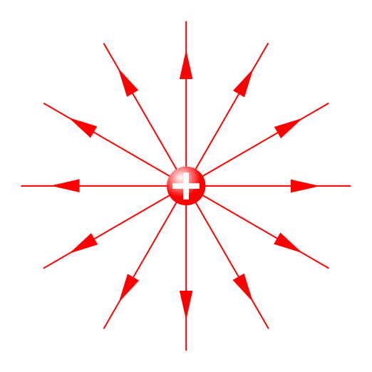
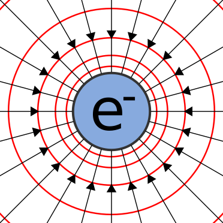
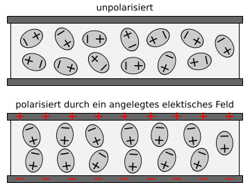
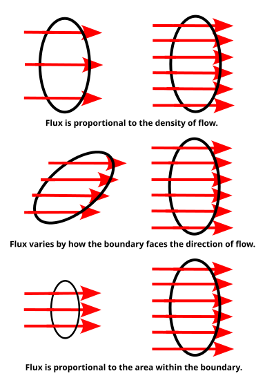

> 介绍电荷、电流、电场、磁场和电磁介质，梳理本构关系、麦克斯韦方程组及其常用表达。

## 1. 电荷、电流与电流密度

### 1.1 电荷

电荷用 $q$ 表示，单位为库仑（C）。电荷是产生电场的基本物理量。

### 1.2 电荷密度

电荷密度 $\rho$ 表示单位体积内包含的电荷量：

$$
\rho=\frac{\mathrm{d}q}{\mathrm{d}V}
$$

单位为 C/m$^3$。

### 1.3 电流

电荷沿某一方向运动，就形成电流：

$$
I=\frac{\mathrm{d}q}{\mathrm{d}t}
$$

单位为安培（A）。也就是说，电流表示单位时间内通过某一截面的电荷量。

### 1.4 电流密度

电流密度 $\mathbf{J}$ 表示单位面积上通过的电流，并且是一个矢量，还包含电流的流动方向：

$$
J=\frac{\mathrm{d}I}{\mathrm{d}A}
$$

单位为 A/m$^2$。在需要表示方向时，使用矢量形式 $\mathbf{J}$。

## 2. 电场与电势

### 2.1 电场强度

电场强度 $\mathbf{E}$ 可以理解为单位正电荷受到的电场力：

$$
\mathbf{E}=\frac{\mathbf{F}}{q}
$$

单位为 N/C，也等价于 V/m。

对于真空中的点电荷 $Q$，距离电荷 $r$ 处的电场可以写为

$$
\mathbf{E}
=\frac{1}{4\pi\varepsilon}
\frac{Q}{r^2}\mathbf{a}_r
$$

<em>图 1：点电荷周围的电场线示意图。</em>

其中，$\mathbf{a}_r$ 是径向单位矢量，$\varepsilon$ 是介质的介电常数。在真空中，$\varepsilon=\varepsilon_0$。

### 2.2 电势与电压

电压 $V$ 描述两点之间的电势差；电场 $\mathbf{E}$ 描述空间中某一点电场的强弱和方向。二者的微分关系为

$$
\mathbf{E}=-\nabla V
$$

<em>图 2：点电荷周围的电场线和等势线。电场线与等势线正交。</em>

负号表示电场总是指向电势下降最快的方向。

## 3. 电位移与介质极化

### 3.1 电位移

电位移 $\mathbf{D}$ 的单位为 C/m$^2$。常用定义为

$$
\mathbf{D}=\varepsilon_0\mathbf{E}+\mathbf{P}
$$

其中，$\mathbf{P}$ 为极化强度。对于线性、各向同性介质，还可以写成

$$
\mathbf{D}=\varepsilon\mathbf{E}
$$

电位移用于描述介质中自由电荷与电场之间的关系。其高斯定律形式为

$$
\nabla\cdot\mathbf{D}=\rho_f
$$

其中，$\rho_f$ 是自由电荷密度。

### 3.2 介质极化

介质受到外加电场作用时会发生极化。极化过程中，介质内部的正、负电荷发生微小的相对位移，使正、负电荷中心不再重合，形成大量定向的电偶极子。

<em>图 3：无外加电场时偶极子取向无序；施加外加电场后，偶极子趋于沿电场方向排列，体现介质极化。</em>

电偶极子由一对相距很近、大小相等而符号相反的电荷组成，整体电荷量为零。用电偶极矩描述电偶极子的强弱：

$$
\mathbf{p}=q\mathbf{d}
$$

其中，$\mathbf{d}$ 表示从负电荷指向正电荷的位移矢量。

### 3.3 介电常数

介电常数 $\varepsilon$ 表示材料对电场的响应能力。相对介电常数为

$$
\varepsilon_r=\frac{\varepsilon}{\varepsilon_0}
$$

## 4. 电通量

电通量表示电场穿过某个面的总量：

$$
\Phi_E=\int_S\mathbf{E}\cdot\mathrm{d}\mathbf{A}
$$

<em>图 4：矢量场穿过曲面的通量示意图。</em>

其中，$\mathrm{d}\mathbf{A}$ 是面元的法向量。电通量的大小不仅与电场强度有关，也与电场穿过面的方向有关。

## 5. 导体内部与电导率

导体内部存在可以自由运动的电荷。电场作用在导体上时，会驱动自由电荷定向运动并形成电流；载流导体周围会产生磁场，磁场也会对运动电荷产生作用力。

电导率用 $\sigma$ 表示，单位为 S/m。导体中的局部欧姆定律为

$$
\mathbf{J}=\sigma\mathbf{E}
$$

电导率越大，在相同电场下产生的电流密度通常越大。

## 6. 磁场与磁通量

磁感应强度（磁通密度）用 $\mathbf{B}$ 表示，单位为特斯拉（T）。在简单的线性、各向同性介质中，磁感应强度与磁场强度 $\mathbf{H}$ 的关系为

$$
\mathbf{B}=\mu\mathbf{H}
$$

<em>图 5：载流直导线周围的磁场线，方向符合右手定则。</em>

磁通量表示磁场穿过某个面的总量，单位为韦伯（Wb）：

$$
\Phi_B=\int_S\mathbf{B}\cdot\mathrm{d}\mathbf{A}
$$

## 7. 麦克斯韦方程组

麦克斯韦方程组的微分形式直接写为：

$$
\nabla\cdot\mathbf{D}=\rho_f
$$

$$
\nabla\cdot\mathbf{B}=0
$$

$$
\nabla\times\mathbf{E}=-\frac{\partial\mathbf{B}}{\partial t}
$$

$$
\nabla\times\mathbf{H}=\mathbf{J}_f+\frac{\partial\mathbf{D}}{\partial t}
$$

### 7.1 电场高斯定律

$$
\nabla\cdot\mathbf{D}=\rho_f
$$

自由电荷是电位移场的源，也就是说，自由电荷会产生电场通量。

### 7.2 磁场高斯定律

$$
\nabla\cdot\mathbf{B}=0
$$

进入一个闭合面的磁通量与离开的磁通量相等，不存在独立的磁荷（磁单极子）。

### 7.3 法拉第电磁感应定律

$$
\nabla\times\mathbf{E}=-\frac{\partial\mathbf{B}}{\partial t}
$$

随时间变化的磁场会产生旋涡电场。

### 7.4 安培–麦克斯韦定律

$$
\nabla\times\mathbf{H}
=\mathbf{J}_f+\frac{\partial\mathbf{D}}{\partial t}
$$

传导电流和随时间变化的电场都会产生磁场。其中，$\mathbf{J}_f$ 为自由电流密度。

## 8. 小结

这页笔记的主要逻辑可以概括为：

1. 电荷是电场的源，电荷的运动形成电流；
2. 电场用 $\mathbf{E}$ 描述，电势与电场满足 $\mathbf{E}=-\nabla V$；
3. 介质在外电场作用下发生极化，并用 $\mathbf{D}$ 和 $\mathbf{P}$ 描述介质响应；
4. 电导率决定导体在电场作用下形成电流的能力，满足 $\mathbf{J}=\sigma\mathbf{E}$；
5. 电场和磁场相互耦合，最终由麦克斯韦方程组统一描述。

## 配图来源

以下五张配图均来自 Wikimedia Commons，已下载到本文章的 `picture/` 目录中，文章不依赖外部图片链接。

- [Electric field of a point charge.svg](https://commons.wikimedia.org/wiki/File:Electric_field_of_a_point_charge.svg)：Victor Blacus，CC BY-SA 3.0。
- [Electric field point lines equipotentials.svg](https://commons.wikimedia.org/wiki/File:Electric_field_point_lines_equipotentials.svg)：Sjlegg，Public domain。
- [Dipole im elektrischen Feld.svg](https://commons.wikimedia.org/wiki/File:Dipole_im_elektrischen_Feld.svg)：Cepheiden 基于 HyperPhysics 图示的整理版本，Public domain。
- [Flux diagram.svg](https://commons.wikimedia.org/wiki/File:Flux_diagram.svg)：RadRafe，Public domain。
- [Wire fieldlines.svg](https://commons.wikimedia.org/wiki/File:Wire_fieldlines.svg)：Lies Van Rompaey，CC BY 3.0。
