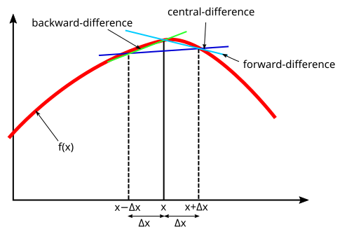
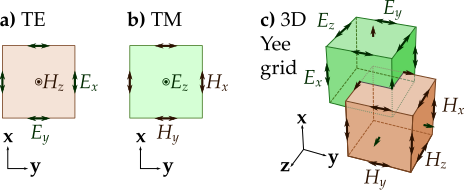

> Day 02 主要学习有限差分和时域有限差分方法（FDTD）。核心思路是把连续空间和时间离散化，用相邻网格点的场值近似导数，再按照麦克斯韦方程组逐时间步更新电场和磁场。

## 1. 有限差分的基本思想

有限差分法的目的，是用离散网格上的函数值和差分近似连续函数的导数。

设一维函数为 $f(x)$，在网格点 $x_i=i\Delta x$ 处记为

$$
f_i=f(x_i)
$$

其中，$\Delta x$ 是空间步长。

### 1.1 前向差分

前向差分使用当前点和右侧相邻点：

$$
f'_ {i}\approx
\frac{f_ {i+1}-f_ {i}}{\Delta x}
$$

由 Taylor 展开可知，前向差分的一阶截断误差为

$$
O(\Delta x)
$$

### 1.2 后向差分

后向差分使用当前点和左侧相邻点：

$$
f'_ {i}\approx
\frac{f_ {i}-f_ {i-1}}{\Delta x}
$$

后向差分同样是一阶精度：

$$
O(\Delta x)
$$

### 1.3 中心差分

中心差分同时使用左右两侧的点：

$$
f'_ {i}\approx
\frac{f_ {i+1}-f_ {i-1}}{2\Delta x}
$$

中心差分的截断误差为

$$
O(\Delta x^2)
$$

因此，在相同网格步长下，中心差分通常比前向差分和后向差分具有更高的空间精度。

### 1.4 二阶导数的中心差分

一维二阶导数可以写成

$$
f''_ {i}\approx
\frac{f_ {i+1}-2f_ {i}+f_ {i-1}}{\Delta x^2}
$$

它同样具有二阶截断误差：

$$
O(\Delta x^2)
$$

<em>图 1：三种常见的一阶有限差分近似。</em>

## 2. 麦克斯韦方程组与本构关系

为了说明 FDTD 更新过程，先写出包含电流源和等效磁流源的旋度方程：

$$
\nabla\times\mathbf{H}=\frac{\partial\mathbf{D}}{\partial t}+\mathbf{J}
$$

$$
\nabla\times\mathbf{E}=-\frac{\partial\mathbf{B}}{\partial t}-\mathbf{J}_m
$$

其中：

- $\mathbf{E}$ 是电场强度；
- $\mathbf{H}$ 是磁场强度；
- $\mathbf{D}$ 是电位移；
- $\mathbf{B}$ 是磁感应强度；
- $\mathbf{J}$ 是电流密度；
- $\mathbf{J}_m$ 是等效磁流密度。

在线性、各向同性介质中，常用本构关系为

$$
\mathbf{D}=\varepsilon\mathbf{E},\qquad\mathbf{B}=\mu\mathbf{H}
$$

有损介质中的欧姆定律为

$$
\mathbf{J}=\sigma\mathbf{E}
$$

如果采用等效磁流模型，还可以写成

$$
\mathbf{J}_m=\sigma_m\mathbf{H}
$$

在普通无磁流介质中，直接取 $\mathbf{J}_m=\mathbf{0}$。等效磁流通常出现在等效原理、特殊边界条件或吸收边界建模中，不能与普通导体中的电流密度混为一谈。

## 3. FDTD 的离散方式

FDTD 同时对空间和时间进行离散：

$$
x=i\Delta x,\qquad y=j\Delta y,\qquad z=k\Delta z,\qquad t=n\Delta t
$$

与普通有限差分相比，FDTD 的关键特点是：

1. 电场和磁场分量交错放置在 Yee 网格中；
2. 电场通常取整数时间层 $n$；
3. 磁场通常取半整数时间层 $n+\frac{1}{2}$；
4. 使用中心差分近似空间导数和时间导数；
5. 通过显式更新公式逐步推进时间。

### 3.1 时间导数的中心差分

对于电场分量 $E_ {x}$，时间导数可以近似为

$$
\left.\frac{\partial E_ {x}}{\partial t}\right|^{n+\frac{1}{2}}\approx\frac{E_ {x}^{n+1}-E_ {x}^{n}}{\Delta t}
$$

为了处理导电项，在半时间层使用时间中心平均：

$$
E_ {x}^{n+\frac{1}{2}}\approx\frac{E_ {x}^{n+1}+E_ {x}^{n}}{2}
$$

### 3.2 空间导数的中心差分

以位于 Yee 网格 x 方向边上的 $E_ {x}$ 为例，相关磁场分量位于它周围的交错位置：

$$
\frac{\partial H_ {z}}{\partial y}\approx\frac{H_ {z}^{n+\frac{1}{2}}\left(i+\frac{1}{2},j+\frac{1}{2},k\right)-H_ {z}^{n+\frac{1}{2}}\left(i+\frac{1}{2},j-\frac{1}{2},k\right)}{\Delta y}
$$

$$
\frac{\partial H_ {y}}{\partial z}\approx\frac{H_ {y}^{n+\frac{1}{2}}\left(i+\frac{1}{2},j,k+\frac{1}{2}\right)-H_ {y}^{n+\frac{1}{2}}\left(i+\frac{1}{2},j,k-\frac{1}{2}\right)}{\Delta z}
$$

## 4. 电场分量更新公式

取安培–麦克斯韦方程的 x 分量：

$$
\frac{\partial H_ {z}}{\partial y}-\frac{\partial H_ {y}}{\partial z}=\varepsilon\frac{\partial E_ {x}}{\partial t}+\sigma E_ {x}
$$

将时间导数和导电项分别用中心差分和时间中心平均近似：

$$
\varepsilon\frac{E_ {x}^{n+1}-E_ {x}^{n}}{\Delta t}+\sigma\frac{E_ {x}^{n+1}+E_ {x}^{n}}{2}=\frac{\Delta H_ {z}}{\Delta y}-\frac{\Delta H_ {y}}{\Delta z}
$$

其中，$\Delta H_ {z}$ 和 $\Delta H_ {y}$ 表示相邻磁场值之差。

整理含有 $E_ {x}^{n+1}$ 的项：

$$
\left(\frac{\varepsilon}{\Delta t}+\frac{\sigma}{2}\right)E_ {x}^{n+1}=\left(\frac{\varepsilon}{\Delta t}-\frac{\sigma}{2}\right)E_ {x}^{n}+\left(\frac{\Delta H_ {z}}{\Delta y}-\frac{\Delta H_ {y}}{\Delta z}\right)
$$

因此，电场分量的更新形式为

$$
E_ {x}^{n+1}=C_AE_ {x}^{n}+C_B\left(\frac{\Delta H_ {z}}{\Delta y}-\frac{\Delta H_ {y}}{\Delta z}\right)
$$

其中

$$
C_A=\frac{1-\frac{\sigma\Delta t}{2\varepsilon}}{1+\frac{\sigma\Delta t}{2\varepsilon}}
$$

$$
C_B=\frac{\frac{\Delta t}{\varepsilon}}{1+\frac{\sigma\Delta t}{2\varepsilon}}
$$

这就是图片中记录的电场更新系数。$C_A$ 描述有损介质对上一时刻电场的衰减，$C_B$ 描述磁场旋度对当前电场的驱动作用。

## 5. Yee 网格与场分量交错

Yee 网格不是把 $\mathbf{E}$ 和 $\mathbf{H}$ 放在同一个网格点上，而是将不同分量放在网格边和网格面的交错位置：

- $E_ {x}$、$E_ {y}$、$E_ {z}$ 分别位于 x、y、z 方向的网格边上；
- $H_ {x}$、$H_ {y}$、$H_ {z}$ 位于与相应边交错的网格面中心；
- 每个电场分量周围都能找到计算其旋度所需的磁场分量；
- 每个磁场分量周围也能找到计算其旋度所需的电场分量。

这种交错布局使旋度离散公式具有清晰的局部结构，并且能够自然地使用中心差分。

<em>图 2：FDTD 在二维和三维情况下的 Yee 网格示意图。</em>

## 6. 电场其他分量与磁场更新

### 6.1 电场的 $E_y$、$E_z$ 更新

电场的 $E_ {y}$、$E_ {z}$ 分量可以通过循环置换坐标得到。例如，在各向同性有损介质中：

$$
E_ {y}^{n+1}=C_AE_ {y}^{n}+C_B\left(\frac{\Delta H_ {x}}{\Delta z}-\frac{\Delta H_ {z}}{\Delta x}\right)
$$

$$
E_ {z}^{n+1}=C_AE_ {z}^{n}+C_B\left(\frac{\Delta H_ {y}}{\Delta x}-\frac{\Delta H_ {x}}{\Delta y}\right)
$$

### 6.2 磁场分量更新

从包含等效磁流的法拉第方程出发：

$$
\nabla\times\mathbf{E}=-\mu\frac{\partial\mathbf{H}}{\partial t}-\mathbf{J}_m
$$

当等效磁流满足 $\mathbf{J}_m=\sigma_m\mathbf{H}$ 时，对磁场使用时间中心差分。以 $H_x$ 为例：

$$
\mu\frac{H_ {x}^{n+\frac{1}{2}}-H_ {x}^{n-\frac{1}{2}}}{\Delta t}+\sigma_m\frac{H_ {x}^{n+\frac{1}{2}}+H_ {x}^{n-\frac{1}{2}}}{2}=-\left(\frac{\Delta E_ {z}}{\Delta y}-\frac{\Delta E_ {y}}{\Delta z}\right)
$$

整理后得到：

$$
H_ {x}^{n+\frac{1}{2}}=D_AH_ {x}^{n-\frac{1}{2}}-D_B\left(\frac{\Delta E_ {z}}{\Delta y}-\frac{\Delta E_ {y}}{\Delta z}\right)
$$

其余两个磁场分量为：

$$
H_ {y}^{n+\frac{1}{2}}=D_AH_ {y}^{n-\frac{1}{2}}-D_B\left(\frac{\Delta E_ {x}}{\Delta z}-\frac{\Delta E_ {z}}{\Delta x}\right)
$$

$$
H_ {z}^{n+\frac{1}{2}}=D_AH_ {z}^{n-\frac{1}{2}}-D_B\left(\frac{\Delta E_ {y}}{\Delta x}-\frac{\Delta E_ {x}}{\Delta y}\right)
$$

磁场更新系数为：

$$
D_A=\frac{1-\frac{\sigma_m\Delta t}{2\mu}}{1+\frac{\sigma_m\Delta t}{2\mu}}
$$

$$
D_B=\frac{\frac{\Delta t}{\mu}}{1+\frac{\sigma_m\Delta t}{2\mu}}
$$

普通介质中通常没有等效磁流，取 $\sigma_m=0$，此时：

$$
D_A=1,\qquad D_B=\frac{\Delta t}{\mu}
$$

### 6.3 最终的六分量更新方程

把电场和磁场更新式合在一起，可以写成紧凑的向量形式：

$$
\mathbf{E}^{n+1}=C_A\mathbf{E}^{n}+C_B\left(\nabla_h\times\mathbf{H}^{n+\frac{1}{2}}\right)
$$

$$
\mathbf{H}^{n+\frac{1}{2}}=D_A\mathbf{H}^{n-\frac{1}{2}}-D_B\left(\nabla_h\times\mathbf{E}^{n}\right)
$$

其中，$\nabla_h$ 表示在 Yee 网格上用中心差分构造的离散旋度。若介质参数随空间变化，$C_A$、$C_B$、$D_A$、$D_B$ 应按电场边和磁场面所在位置分别存储，不能简单地使用一个全局常数。

## 7. 稳定性与网格选择

FDTD 是显式时间推进方法，时间步长不能任意增大。对三维直角网格，常用的 CFL 稳定性条件为

$$
\Delta t\le\frac{S}{v_{\max}\sqrt{\frac{1}{\Delta x^2}+\frac{1}{\Delta y^2}+\frac{1}{\Delta z^2}}}
$$

其中，$0<S\le 1$ 是安全系数，$v_{\max}$ 是计算区域内允许的最大波速。均匀、无色散介质中有

$$
v=\frac{1}{\sqrt{\mu\varepsilon}}
$$

网格尺寸还需要能够解析最短波长。通常应保证每个最短波长内具有足够多的网格单元，否则即使满足 CFL 条件，数值色散仍然可能比较明显。

## 8. 工程实现中的注意事项

### 8.1 电导率与损耗

当 $\sigma=0$ 时，

$$
C_A=1,\qquad C_B=\frac{\Delta t}{\varepsilon}
$$

此时介质无电导损耗。$\sigma$ 增大时，$C_A$ 会体现电场的衰减。

### 8.2 边界条件

有限计算区域必须设置边界条件。常见方法包括：

- PEC 或 PMC 理想边界；
- 一阶或高阶吸收边界；
- PML 完美匹配层；
- 周期边界；
- 对称边界。

如果边界处理不当，出射波会反射回计算区域，影响场分布和频域结果。

### 8.3 浮点精度和长时间推进

FDTD 每个时间步都会积累数值误差。实际实现中需要关注：

1. 介质参数是否使用一致的单位制；
2. $\Delta t$ 是否满足全局最小网格的稳定性条件；
3. 材料参数是否在所有 Yee 位置正确映射；
4. 激励源是否与电场或磁场的时间层匹配；
5. 长时间计算中是否出现非物理增长。

## 9. 计算流程总结

一个基本的三维 FDTD 时间推进流程如下：

1. 初始化 $\mathbf{E}$、$\mathbf{H}$ 和材料参数；
2. 根据当前电场更新半时间层的磁场；
3. 根据新的磁场更新整数时间层的电场；
4. 在边界处施加边界条件或 PML；
5. 注入源并记录监视器数据；
6. 重复推进，直到达到目标时间；
7. 对记录的时域数据进行 FFT，得到频域响应。

## 10. 小结

Day 02 的核心逻辑是：

1. 前向差分和后向差分是一阶精度；
2. 中心差分是一种常用的二阶精度近似；
3. FDTD 用中心差分离散麦克斯韦旋度方程；
4. Yee 网格将电场和磁场分量交错放置；
5. 电导率会带来电场更新系数 $C_A$ 的衰减；
6. 时间步长必须满足 CFL 稳定性条件；
7. 实际计算还必须处理边界、材料、源和浮点误差。

有限差分公式只是离散化的起点。要得到可靠的电磁仿真结果，还需要同时保证网格分辨率、时间步长、材料映射、边界条件和源定义彼此一致。

## 图片来源与许可

- [Finite difference method.svg](https://commons.wikimedia.org/wiki/File:Finite_difference_method.svg)：Wikimedia Commons，作者 Kakitc，CC BY-SA 4.0。
- [FDTD Yee grid 2d-3d.svg](https://commons.wikimedia.org/wiki/File:FDTD_Yee_grid_2d-3d.svg)：Wikimedia Commons，作者 FDominec，CC BY-SA 4.0。
