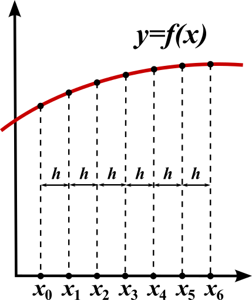
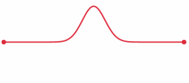

> Day 03 主要学习一维波动方程的有限差分稳定性、CFL 条件、FDTD 空间步长限制和数值色散。核心思路是通过中心差分和谐波假设分析离散方程的放大因子，再从相速度误差推导时间步长与空间步长的约束。

## 1. 一维波动方程

在均匀、无损介质中，电场的一维传播可以抽象为波动方程：

$$
\frac{\partial^2 E}{\partial t^2}=c^2\frac{\partial^2 E}{\partial x^2}
$$

其中，$c$ 是波在介质中的传播速度，$E(x,t)$ 是待求的电场分量。FDTD 的基本做法，是把连续的空间和时间划分成离散网格：

$$
x_i=i\Delta x,\qquad t_n=n\Delta t
$$

离散场值记为

$$
E_i^n=E(x_i,t_n)
$$

有限差分方法的一个重要优点，是可以把偏微分方程转化为只依赖相邻网格点和相邻时间层的代数递推式。

<em>图 1：有限差分用离散节点近似连续函数及其导数。</em>

## 2. 中心差分离散

### 2.1 时间二阶导数

在时间层 $n$ 处使用中心差分：

$$
\frac{\partial^2 E}{\partial t^2}
\approx
\frac{E_i^{n+1}-2E_i^n+E_i^{n-1}}{\Delta t^2}
$$

### 2.2 空间二阶导数

在空间节点 $i$ 处使用中心差分：

$$
\frac{\partial^2 E}{\partial x^2}
\approx
\frac{E_{i+1}^n-2E_i^n+E_{i-1}^n}{\Delta x^2}
$$

将两式代入波动方程，得到离散差分方程：

$$
E_i^{n+1}-2E_i^n+E_i^{n-1}=
\left(\frac{c\Delta t}{\Delta x}\right)^2
\left(E_{i+1}^n-2E_i^n+E_{i-1}^n\right)
$$

记 Courant 数为

$$
S=\frac{c\Delta t}{\Delta x}
$$

则上式可以写成

$$
E_i^{n+1}=2E_i^n-E_i^{n-1}+S^2
\left(E_{i+1}^n-2E_i^n+E_{i-1}^n\right)
$$

这就是一维波动方程的显式时间推进形式。已知前两个时间层的场值后，就可以计算下一个时间层。

## 3. 用谐波假设分析稳定性

为了研究误差在时间推进过程中是否会不断放大，可以令离散场采用谐波形式：

$$
E_i^n=\xi^n\exp\left(\mathrm{i}k i\Delta x\right)
$$

其中，$\xi$ 是时间推进对应的放大因子，$k$ 是波数。

将该形式代入差分方程，并利用

$$
\exp(\mathrm{i}k\Delta x)+\exp(-\mathrm{i}k\Delta x)
=2\cos(k\Delta x)
$$

可以得到关于 $\xi$ 的特征方程：

$$
\xi^2-2A\xi+1=0
$$

其中

$$
A=1-2S^2\sin^2\left(\frac{k\Delta x}{2}\right)
$$

稳定传播要求放大因子的模不超过 1。对于这个二次方程，要求其根落在单位圆上，等价于

$$
|A|\le 1
$$

由于

$$
0\le\sin^2\left(\frac{k\Delta x}{2}\right)\le 1
$$

最严格的约束来自 $A$ 的最小值：

$$
1-2S^2\ge -1
$$

因此得到一维稳定性条件

$$
S\le 1
$$

也就是

$$
c\Delta t\le\Delta x
$$

## 4. CFL 条件的物理含义

上面的数学推导说明，时间步长和空间步长不能独立选择。一个时间步内，物理波传播的距离为

$$
c\Delta t
$$

在一维情况下，这个距离不能超过一个网格间距，否则数值计算的依赖范围会落后于物理波的传播范围，误差可能在推进过程中迅速放大。

因此，CFL 条件可以理解为：

> 数值信息在一个时间步内能够传播的范围，必须覆盖实际物理传播所需要的范围；显式算法不能允许数值波传播得比物理波更快。

对于三维直角网格，常用的 CFL 稳定性条件为

$$
\Delta t\le
\frac{S_{\mathrm{safe}}}
{v_{\mathrm{max}}\sqrt{\frac{1}{\Delta x^2}+\frac{1}{\Delta y^2}+\frac{1}{\Delta z^2}}}
$$

其中，$S_{\mathrm{safe}}$ 是不超过 1 的安全系数，$v_{\mathrm{max}}$ 是计算区域内的最大波速。对于均匀介质，波速为

$$
v=\frac{1}{\sqrt{\mu\varepsilon}}
$$

三维条件比一维条件更严格，因为一个时间步内的传播会同时受到三个方向网格尺寸的限制。

<em>图 2：一维波动方程的波形传播与端点反射示意图。</em>

## 5. 空间步长与波长分辨率

满足 CFL 条件只能保证显式差分格式不发散，并不能保证数值解已经足够准确。空间步长还必须能够分辨计算区域中的最短波长。

在均匀、无损介质中，连续平面波满足

$$
k=\frac{\omega}{c}
$$

因此，连续模型中的相速度为

$$
v_{\mathrm{p}}=\frac{\omega}{k}=c
$$

### 5.1 空间差分造成的相速度误差

对空间二阶中心差分进行谐波分析，可得到空间离散对应的波数关系：

$$
\tilde{k}=\frac{2}{\Delta x}
\sin\left(\frac{k\Delta x}{2}\right)
$$

当只考察空间差分、并把时间离散误差单独忽略时，数值相速度可以近似写成

$$
v_{\mathrm{p,num}}
\approx
c\left|
\frac{\sin(k\Delta x/2)}{k\Delta x/2}
\right|
$$

令

$$
s=\frac{k\Delta x}{2}
$$

当 $s$ 较小时，有 $\sin s\approx s$，于是数值相速度接近真实波速。反过来，如果 $k\Delta x$ 较大，$\sin s/s$ 会明显偏离 1，数值波的相位就会逐渐落后于连续解。

因此，空间步长应远小于波长：

$$
\Delta x\ll\lambda
$$

也可以写成

$$
\Delta x\le\frac{\lambda_{\mathrm{min}}}{N_{\lambda}}
$$

其中，$\lambda_{\mathrm{min}}$ 是计算区域内的最短波长，$N_{\lambda}$ 是每个波长内设置的网格数量。$N_{\lambda}$ 应根据允许的相位误差、材料变化和结构细节进行选择。

### 5.2 完全离散后的数值色散

对于同时离散时间和空间的一维波动方程，差分格式的离散色散关系为

$$
\sin^2\left(\frac{\omega\Delta t}{2}\right)=
S^2\sin^2\left(\frac{k\Delta x}{2}\right)
$$

这说明数值解中的 $\omega$、$k$ 和连续介质中的关系不再完全相同。不同频率对应的数值相速度不同，这种误差称为数值色散。

在二维或三维 FDTD 中，数值相速度还会随传播方向变化。同一个频率沿不同方向传播时，可能得到不同的相位误差，表现为数值各向异性。因此，空间步长过大不仅会导致波长分辨率不足，还可能改变波前形状和传播方向上的相位关系。

## 6. 稳定性与精度的区别

稳定性和精度是两个不同的问题：

| 问题 | 主要约束 | 结果 |
| --- | --- | --- |
| 稳定性 | 时间步长满足 CFL 条件 | 数值解不发生非物理爆炸 |
| 空间精度 | 网格能够分辨最短波长 | 相位和波形误差可接受 |
| 数值色散 | 减小空间、时间离散误差 | 不同频率和方向的波速更接近真实值 |

因此，即使满足

$$
c\Delta t\le\Delta x
$$

仍然可能因为 $\Delta x$ 太大而产生明显的数值色散。工程计算中通常先根据最短波长和几何细节确定空间网格，再根据 CFL 条件确定时间步长，并额外保留一定安全裕量。

## 7. 实现时的检查顺序

一个实用的参数选择流程如下：

1. 根据最高频率和介质参数估计最短波长 $\lambda_\mathrm{min}$。
2. 根据允许的相位误差和结构细节选择每波长网格数 $N_\lambda$。
3. 计算各方向的空间步长 $\Delta x$、$\Delta y$、$\Delta z$。
4. 使用全局最小网格和最大波速计算 CFL 时间步长上限。
5. 给时间步长乘以安全系数，得到实际使用的 $\Delta t$。
6. 用短时间测试检查场值是否有限、波形是否稳定，以及波前是否出现明显畸变。

## 8. 小结

Day 03 的核心结论是：

1. 一维波动方程可以通过时间和空间中心差分转化为显式递推式。
2. 采用谐波假设后，可以用放大因子分析差分格式的稳定性。
3. 一维显式差分格式的 CFL 条件为 $c\Delta t\le\Delta x$。
4. CFL 条件解决的是数值解是否发散，不能单独保证计算精度。
5. 空间步长应明显小于最短波长，以减小相位误差。
6. 空间和时间离散会引入数值色散，二维和三维情况下还会产生数值各向异性。

## 图片来源与许可

- [Finite Differences.svg](https://commons.wikimedia.org/wiki/File:Finite_Differences.svg)：Wikimedia Commons，作者 User:Mintz l，公共领域（Public domain）。
- [Wave equation 1D fixed endpoints.gif](https://commons.wikimedia.org/wiki/File:Wave_equation_1D_fixed_endpoints.gif)：Wikimedia Commons，作者 Oleg Alexandrov，公共领域（Public domain）。
