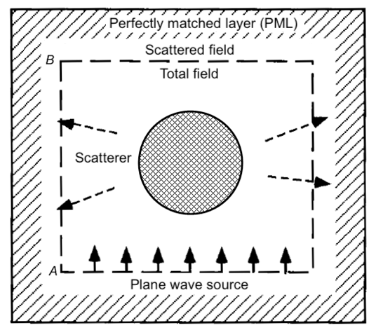
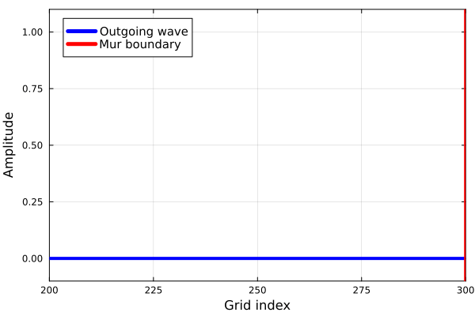

> Day 04 主要学习二维波动方程的单向传播分解、Engquist–Majda 吸收边界条件和 Mur 一阶吸收边界。核心思路是将波动算子因式分解为单向传播算子，再用低阶近似和差分离散抑制有限计算区域边界产生的非物理反射。

## 1. 为什么需要吸收边界条件

FDTD 通常只在有限计算区域内推进电磁场，但实际电磁波可能会向无限远处传播。如果直接在计算区域边缘截断场值，出射波会被边界反射回来，形成非物理的驻波和干扰。

吸收边界条件的目标，是在有限区域边界上近似满足“波继续向外传播”的条件，使出射波尽量离开计算区域而不返回内部。

理想的吸收边界需要满足两个要求：

1. 对目标出射波尽量透明；
2. 计算量和存储量不能过高，便于嵌入 FDTD 的时间推进过程。

<em>图 1：FDTD 中平面波源、总场/散射场区域与外围 PML 边界的关系。</em>

Engquist–Majda 方法从连续波动方程出发构造单向传播边界，Mur 方法则进一步把低阶单向传播条件离散成容易实现的更新公式。

## 2. 二维波动方程与平面波

考虑二维标量波动方程：

$$
\frac{\partial^2 f}{\partial x^2}+\frac{\partial^2 f}{\partial y^2}-\frac{1}{c^2}\frac{\partial^2 f}{\partial t^2}=0
$$

设平面波形式为

$$
f(x,y,t)=A\exp\left[\mathrm{i}\left(\omega t-k_xx-k_yy\right)\right]
$$

代入波动方程后得到色散关系：

$$
k_x^2+k_y^2=k^2=\frac{\omega^2}{c^2}
$$

其中：

- $k_x$ 是波数在法向方向上的分量；
- $k_y$ 是波数在切向方向上的分量；
- $k=\omega/c$ 是总波数；
- $c$ 是均匀介质中的传播速度。

在边界 $x=0$ 附近，$k_y$ 表示波沿边界方向的变化，而 $k_x$ 决定波是否向计算域外传播。

## 3. 单向传播波的分解

由色散关系可得

$$
k_x=\sqrt{k^2-k_y^2}
$$

因此，在固定的 $\omega$ 和 $k_y$ 下，波动方程关于 $x$ 的部分满足

$$
\frac{\partial^2 f}{\partial x^2}+\left(k^2-k_y^2\right)f=0
$$

它可以分解为两个一阶算子的乘积：

$$
\left(\frac{\partial}{\partial x}-\mathrm{i}\sqrt{k^2-k_y^2}\right)\left(\frac{\partial}{\partial x}+\mathrm{i}\sqrt{k^2-k_y^2}\right)f=0
$$

记两个一阶算子为

$$
L_-=\frac{\partial}{\partial x}-\mathrm{i}\sqrt{k^2-k_y^2}
$$

$$
L_+=\frac{\partial}{\partial x}+\mathrm{i}\sqrt{k^2-k_y^2}
$$

于是波动方程可以写成

$$
L_-L_+f=0
$$

### 3.1 两个传播方向

沿 $x$ 方向传播的两支平面波可以写成

$$
f_-(x,y,t)=A_-\exp\left[\mathrm{i}\left(\omega t+k_xx-k_yy\right)\right]
$$

$$
f_+(x,y,t)=A_+\exp\left[\mathrm{i}\left(\omega t-k_xx-k_yy\right)\right]
$$

它们分别满足

$$
L_-f_-=0
$$

$$
L_+f_+=0
$$

也就是说，一个一阶算子可以精确消去一个传播方向的波。只要在边界上保留与目标出射方向对应的算子，就能构造单向传播边界条件。

这里的正负号取决于时间因子、空间因子和边界法向的约定。实现时应先固定相位约定，再决定左边界和右边界分别使用哪个符号，不能直接套用符号而不检查传播方向。

## 4. Engquist–Majda 吸收边界条件

### 4.1 精确单向边界的形式

在频域中，精确的单向边界条件可以写成

$$
\left(\frac{\partial}{\partial x}-\mathrm{i}\sqrt{k^2-k_y^2}\right)f=0
$$

它要求边界处的场只包含指定方向的出射波，不包含从边界返回计算域的反射波。

但这个条件包含横向波数 $k_y$，转换到时域后相当于包含非局部的微分算子，直接计算代价较高。因此，Engquist–Majda 方法对传播算子进行渐近展开，得到一组不同阶数的局部近似边界条件。

### 4.2 一阶近似

将法向波数写成

$$
\sqrt{k^2-k_y^2}=k\sqrt{1-\left(\frac{k_y}{k}\right)^2}
$$

当波主要沿边界法向传播、入射角较小时，$k_y/k$ 较小，可以使用

$$
\sqrt{1-\xi}\approx1-\frac{\xi}{2}-\frac{\xi^2}{8}+\cdots
$$

保留零阶项，得到

$$
\sqrt{k^2-k_y^2}\approx k
$$

由于 $k=\omega/c$，对应的时域一阶单向边界可以写成

$$
\left(\frac{\partial}{\partial x}-\frac{1}{c}\frac{\partial}{\partial t}\right)f=0
$$

在相反的边界或相反的传播方向上，法向导数项的符号需要改变。

### 4.3 高阶近似的意义

如果保留展开式中的横向修正项，就可以得到包含切向导数的高阶吸收边界条件。高阶条件能够更好地处理斜入射波，但公式、离散模板和边界角点处理都会更复杂。

因此，Engquist–Majda 方法体现了一个基本权衡：

- 低阶条件：实现简单、计算量小，但斜入射反射较明显；
- 高阶条件：吸收效果更好，但需要更多邻域信息和更复杂的离散；
- 完全匹配层：吸收性能通常更强，但需要额外的辅助变量和参数设置。

## 5. Mur 一阶吸收边界条件

Mur 边界条件可以看作一阶单向传播条件的显式差分实现。它不再直接计算频域中的平方根算子，而是使用时间和空间差分近似

$$
\left(\frac{\partial}{\partial x}-\frac{1}{c}\frac{\partial}{\partial t}\right)f=0
$$

### 5.1 差分更新公式

设计算区域的左边界为 $i=0$，相邻内部点为 $i=1$，时间层为 $n$。定义一维 Courant 数

$$
S=\frac{c\Delta t}{\Delta x}
$$

Mur 一阶边界的常用更新公式为

$$
f_0^{n+1}=f_1^n+\frac{S-1}{S+1}\left(f_1^{n+1}-f_0^n\right)
$$

右边界的形式为

$$
f_N^{n+1}=f_{N-1}^n+\frac{S-1}{S+1}\left(f_{N-1}^{n+1}-f_N^n\right)
$$

其中，边界位置的场值由相邻内部点和前一时间层的边界值共同决定。

当 $S=1$ 时，修正系数为零，公式退化为

$$
f_0^{n+1}=f_1^n
$$

这表示波在一个时间步内恰好传播一个网格间距。实际 FDTD 中通常需要同时满足 CFL 条件和 Mur 边界的更新时序要求。

<em>图 2：一维 FDTD 中 Mur 吸收边界条件的波传播示意。</em>

### 5.2 二维边界与角点

二维计算区域通常需要在四条边界分别施加吸收条件：

- 左边界和右边界使用关于 $x$ 方向的单向条件；
- 下边界和上边界使用关于 $y$ 方向的单向条件；
- 四个角点同时属于两条边界，需要单独处理。

一种简单的角点处理方式是组合相邻两条边界的更新结果，但这并不一定具有最佳吸收效果。对于对角方向传播的波，角点附近通常是反射误差较明显的位置。

## 6. Mur 边界的反射误差

一阶边界条件是在小入射角或近法向入射条件下得到的近似。当平面波以入射角 $\theta$ 斜入射到边界时，切向波数 $k_y$ 不能忽略，一阶近似会产生反射。

在常见的时间和符号约定下，一阶 Mur 边界的幅度反射系数可写成

$$
\mathcal{R}(\theta)=\frac{\cos\theta-1}{\cos\theta+1}
$$

其大小为

$$
\left|\mathcal{R}(\theta)\right|=\frac{1-\cos\theta}{1+\cos\theta}
$$

当 $\theta=0$ 时，反射系数为零，说明法向入射时一阶条件效果最好。随着入射角增大，反射系数逐渐增大，接近掠入射时吸收效果明显变差。

这也解释了为什么 Mur 边界适合作为入门和低成本吸收边界，但在宽角度、多方向传播或高精度电磁仿真中，通常需要更高阶 Engquist–Majda 条件或 PML。

## 7. FDTD 中的实现流程

在 FDTD 时间推进中，吸收边界通常按照下面的顺序处理：

1. 根据当前时间层更新内部磁场；
2. 根据新的磁场更新内部电场；
3. 在左、右、上、下边界使用对应方向的 Mur 更新公式；
4. 对角点使用预先确定的角点规则；
5. 注入源并记录监视器数据；
6. 检查边界附近是否出现明显的返回波。

实现时还需要注意：

- 边界更新使用的是哪个时间层；
- 电场和磁场是否位于 Yee 网格的正确位置；
- 左右边界的法向方向是否使用了相反符号；
- $\Delta t$、$\Delta x$、$\Delta y$ 是否与 CFL 条件一致；
- 源点是否距离吸收边界足够远；
- 多次反射后边界误差是否污染观测区域。

## 8. 吸收边界条件的选择

| 方法 | 主要思想 | 优点 | 局限 |
| --- | --- | --- | --- |
| 一阶 Mur | 一阶单向波方程的差分 | 简单、便宜、易实现 | 斜入射反射较明显 |
| 高阶 Engquist–Majda | 保留更多切向传播信息 | 角度适应性更好 | 离散和角点处理更复杂 |
| PML | 构造理论上无反射的匹配层 | 吸收性能强、适用范围广 | 参数、内存和实现复杂度更高 |

如果只是验证一维 FDTD 波传播，一阶 Mur 通常已经足够。如果计算区域内存在复杂结构、宽频激励或大量斜向传播，则应优先评估高阶 ABC 或 PML。

## 9. 小结

Day 04 的核心内容可以概括为：

1. 有限计算区域会截断出射波，因此需要吸收边界条件；
2. 二维波动方程可以通过平面波假设分解为不同传播方向的波；
3. Engquist–Majda 方法通过波动算子的因式分解构造单向传播边界；
4. 对平方根传播算子做低阶展开，可以得到简单的一阶边界条件；
5. Mur 边界是该类一阶单向条件的显式差分实现；
6. Mur 边界在法向入射时效果较好，但斜入射时反射误差增大；
7. 二维计算还需要处理四条边界和角点；
8. 对高精度和宽角度传播问题，应考虑高阶 Engquist–Majda 或 PML。

## 图片来源与许可

- [FDTD TFSF (English).png](https://commons.wikimedia.org/wiki/File:FDTD_TFSF_%28English%29.png)：Wikimedia Commons，作者 Dominator9000，CC BY-SA 4.0。
- [Mur absorbing boundary condition in 1D FDTD.gif](https://commons.wikimedia.org/wiki/File:Mur_absorbing_boundary_condition_in_1D_FDTD.gif)：Wikimedia Commons，作者 Myxomatosis57，CC BY 4.0。
